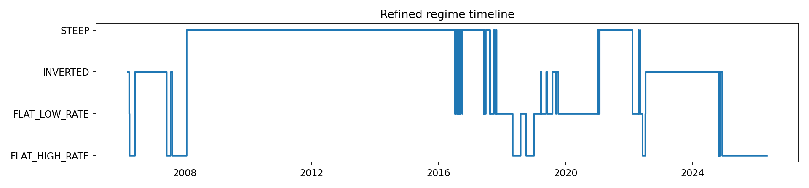
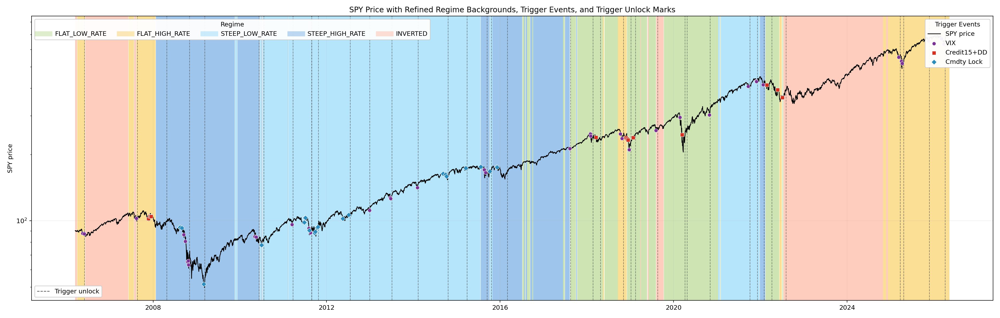

# Regime-Aware Stress Timing and Hedge Allocation Strategy

## Final Result

This project builds a SPY-centered regime-aware index enhancement strategy. By combining regime-conditioned stress timing, trigger-lock exits, and regime-specific hedge allocation, the final strategy improves both return and drawdown control relative to SPY buy-and-hold.


| Strategy | CAGR | Sharpe | Sortino | MaxDD | Calmar | Final Equity |
|---|---:|---:|---:|---:|---:|---:|
| SPY_BUY_HOLD | 11.14% | 0.575 | 0.702 | -55.19% | 0.202 | 8.38 |
| SPY_CASH_TIMING | 12.04% | 0.948 | 1.101 | -29.45% | 0.409 | 9.86 |
| FINAL_REGIME_HEDGE_TRIGGER_LOCK | 20.20% | 1.492 | 2.013 | -15.94% | 1.267 | 40.61 |

Compared with SPY buy-and-hold, the final strategy improves CAGR from 11.14% to 20.20%, raises Sharpe from 0.575 to 1.492, and reduces MaxDD from -55.19% to -15.94%. The improvement is not driven by one universal signal. It comes from combining regime-specific stress triggers, trigger-lock stress periods, and regime-specific hedge allocation.


## Core Insight

**Stress triggers are regime-dependent, and hedge assets are also regime-dependent.**

VIX, credit, and commodity stress do not have the same meaning in every regime. GOLD, IEF, CASH, commodities, and SPY do not have fixed roles across regimes. The final framework therefore conditions both stress detection and hedge allocation on the macro regime. This is why the project is not a traditional all-weather portfolio or a generic timing model.

## Framework

```text
ML regime discovery
        ->
Rule-based macro regimes
        ->
Regime-specific trigger-lock stress detection
        ->
Regime x stress asset behavior
        ->
Regime-specific hedge allocation
        ->
Final SPY-centered index enhancement strategy
```

This project is not a traditional all-weather portfolio and not a generic market-timing system. It is a **SPY-centered regime-aware index enhancement strategy**. The goal is to preserve SPY as the long-term return engine while using regime-conditioned stress triggers and regime-specific hedge allocation to reduce major bear-market and stress-period drawdowns.

The final strategy is:

`FINAL_REGIME_HEDGE_TRIGGER_LOCK`

It is built from source data only and is designed to be interpretable, reproducible, and economically grounded.

## From ML Regime Discovery to Rule-Based Regimes

This project grew out of earlier machine-learning regime research:

[Market-Regime-Clustering](https://github.com/Snow-Ouyang/Market-Regime-Clustering)

The ML clustering / jump-model work helped reveal how macro variables naturally cluster across history. It was used as a discovery layer, not as a direct trading state. The final strategy converts that ML-guided intuition into rule-based macro regimes because rule-based regimes are easier to audit, reproduce, and interpret.

The translation was:

- Use ML clustering to observe natural macro distributions and unusual stress states.
- Use distribution diagnostics to identify economically meaningful regime boundaries.
- Replace black-box state labels with transparent rules based on yield-curve shape and rate level.
- Keep the final tradable strategy rule-based rather than trading directly on ML labels.

Local TODO: the current cleaned repository does not retain the old clustering variable-distribution figures. Those are available from the upstream ML project and can be copied into `results/main_pipeline_final/figures/` if this README is later expanded with the discovery appendix.

## Regime Framework

The final regimes are:

- `FLAT_LOW_RATE`
- `FLAT_HIGH_RATE`
- `STEEP_LOW_RATE`
- `STEEP_HIGH_RATE`
- `INVERTED`

The first layer uses:

`term_spread = GS10 - GS1`

| Regime | Rule | Threshold Source | Economic Interpretation | Strategy Implication |
|---|---|---|---|---|
| `INVERTED` | `term_spread < 0` | Yield-curve inversion | Tight-policy / late-cycle inversion; stress triggers were not robust enough here | No full-risk trigger; use SPY / GOLD inverse-vol |
| `FLAT` raw state | `0 <= term_spread <= 1` | Flat curve band | Curve shape alone is not enough; absolute rate level matters | Split into low-rate and high-rate flat |
| `FLAT_LOW_RATE` | `FLAT` and `GS10 <= 3.0` | Rounded from the flat-regime GS10 diagnostic threshold | Low-rate flat environments where SPY and commodities can still be effective normal-state assets | Normal pool: SPY / CMDTY_FUT |
| `FLAT_HIGH_RATE` | `FLAT` and `GS10 > 3.0` | Same GS10 split | High-rate flat environments; equity exposure is less attractive and real assets dominate | Normal pool: GOLD / CMDTY_FUT |
| `STEEP_LOW_RATE` | `term_spread > 1` and confirmed `GS1 <= 0.3` | Short-rate split from STEEP GS1 diagnostics | Low policy-rate steep curves where SPY remains the clean return engine | Normal pool: 100% SPY |
| `STEEP_HIGH_RATE` | `term_spread > 1` and confirmed `GS1 > 0.3` | Same GS1 split with 3-day confirmation | Steep curve with higher short-rate pressure; commodities add useful diversification | Normal pool: SPY / CMDTY_FUT inverse-vol |

The `GS10 = 3.0` threshold is not treated as an optimized trading parameter. It is the rounded version of the flat-regime rate-level diagnostic threshold. It is used because `FLAT_LOW_RATE` and `FLAT_HIGH_RATE` showed materially different asset behavior.

The `GS1 = 0.3` threshold is used only inside confirmed `STEEP` regimes. GS1 is a cleaner short-rate variable than GS10 for this purpose because it better reflects policy-rate level, cash yield, and financing cost. The high/low STEEP split also uses 3-day confirmation. The key empirical finding is that commodities behave differently in `STEEP_LOW_RATE` and `STEEP_HIGH_RATE`: adding CMDTY_FUT to the inverse-vol framework in `STEEP_HIGH_RATE_NORMAL` reduced the SPY path drawdown while preserving equity participation. We also ran an inverse-vol window grid search and found strategy performance was not materially sensitive across reasonable windows, so the final mainline uses a 90-day inverse-vol setting.

The ML work also showed oil-shock / policy-driven inflation-like states. In the current source-only tradable sample, this did not become a stable separate `EXTREME_INFLATION` regime. The final strategy therefore does not force a regime that the current sample cannot support, but the finding explains why real assets, commodities, and gold remain important in the allocation research.

## Why This Is Not a Traditional All-Weather Portfolio

Traditional all-weather portfolios usually allocate across growth / inflation quadrants with relatively static asset sleeves. This project is different.

This is a **SPY-centered regime-aware index enhancement strategy**. The goal is not to minimize volatility at all costs, but to preserve equity participation while reducing major regime-specific drawdowns.

The final portfolio:

- keeps SPY as the primary return engine where the regime supports equity risk;
- uses macro regime to decide which stress triggers are active;
- uses trigger-lock stress episodes rather than one-day exit signals;
- uses regime-specific hedge assets instead of a universal hedge sleeve.

Monthly trend timing was explored as an early benchmark, but the final strategy replaces it with a higher-frequency trigger-lock stress system.

## Regime-Specific Trigger-Lock Stress System

The final strategy does not use a one-shot trigger. It uses a **trigger-lock state machine**. A trigger creates an active lock. The strategy remains in full-risk mode until all active locks have been unlocked by their own recovery conditions.

| Trigger | Enabled Regimes | Entry | Unlock | Economic Meaning | Main Purpose |
|---|---|---|---|---|---|
| VIX lock | `STEEP_LOW_RATE`, `STEEP_HIGH_RATE`, `FLAT_LOW_RATE`, `FLAT_HIGH_RATE` | `VIX_ZSCORE_120D >= 3.0` | `VIX_ZSCORE_120D < 1.5` | Fast panic / volatility shock | Capture sudden volatility stress |
| Credit lock | `FLAT_LOW_RATE`, `FLAT_HIGH_RATE` | SPY drawdown <= -5% and `D_CREDIT_SPREAD_15D > 0.10` | `D_CREDIT_SPREAD_15D < 0` and SPY > MA20 | Price-confirmed credit stress | Avoid credit-led drawdown after equity weakness is already visible |
| Commodity lock | `STEEP_LOW_RATE`, `STEEP_HIGH_RATE` | `CMDTY_RET60 < -10%` | `CMDTY_RET60 > -5%` and SPY > MA20 | STEEP slow-growth / commodity-led stress | Repair 2015-2016 style slow-growth stress |

Trigger activation is regime-specific:

- VIX is not treated as a universal all-regime allocation command.
- Credit stress is useful in FLAT regimes but is not enabled in INVERTED.
- Commodity weakness is mainly used as a STEEP slow-growth stress trigger in both STEEP low-rate and high-rate normal regimes.
- INVERTED has no full-risk trigger in the final strategy because historical diagnostics did not support a robust trigger there.

## Trigger-to-Unlock Episode Diagnostics

Because the final strategy is lock-based, trigger quality should be evaluated from trigger entry to unlock exit, not only by 20-day or 60-day forward returns.

| Regime | Trigger | Episodes | Avg Lock Duration | Mean Strategy Return During Stress | Mean SPY Return During Stress | Mean SPY MaxDD During Stress | Mean Drawdown Reduction vs SPY |
|---|---:|---:|---:|---:|---:|---:|---:|
| `FLAT_HIGH_RATE` | CREDIT | 2 | 66.0d | 3.99% | -3.25% | -15.50% | 11.97% |
| `FLAT_HIGH_RATE` | VIX | 7 | 12.6d | -0.02% | 1.24% | -3.55% | 2.54% |
| `FLAT_LOW_RATE` | CREDIT | 5 | 26.4d | 3.05% | 2.44% | -5.58% | 2.31% |
| `FLAT_LOW_RATE` | VIX | 4 | 16.0d | 0.94% | -2.92% | -10.32% | 6.18% |
| `STEEP` | CMDTY | 8 | 66.8d | 4.68% | -3.15% | -13.52% | 10.23% |
| `STEEP` | VIX | 9 | 8.8d | -0.61% | 2.08% | -2.13% | 1.00% |

Interpretation:

- VIX lock captures fast-crash risk, especially when panic is large enough to matter.
- Credit lock captures price-confirmed credit stress, with the strongest drawdown-reduction evidence in `FLAT_HIGH_RATE`.
- Commodity lock is the main repair mechanism for STEEP slow-growth stress, including the 2015-2016 commodity / growth scare.
- Trigger effectiveness is not constant across regimes.

Relevant files:

- `results/main_pipeline_final/tables/stress_entry_attribution.csv`
- `results/main_pipeline_final/tables/trigger_effectiveness_summary.csv`
- `results/main_pipeline_final/figures/stress_entry_timeline_by_trigger.png`
- `results/main_pipeline_final/figures/trigger_regime_spy_timeline_long.png`

## Regime x Stress Asset Behavior

The final allocation is not assigned arbitrarily. It is derived from observed asset behavior under each regime-stress cross state.

Key findings:

- `FLAT_LOW_RATE_NORMAL`: SPY and commodities are strong; GOLD is not needed in the normal pool.
- `FLAT_LOW_RATE_STRESS`: GOLD is the cleanest defensive asset.
- `FLAT_HIGH_RATE_NORMAL`: GOLD and commodities dominate SPY; the final normal pool uses GOLD / CMDTY_FUT.
- `FLAT_HIGH_RATE_STRESS`: IEF has the best stress behavior, while CASH stabilizes path risk.
- `STEEP_LOW_RATE_NORMAL`: SPY remains the best return engine.
- `STEEP_HIGH_RATE_NORMAL`: SPY remains useful, but commodities improve diversification and reduce the SPY-only drawdown profile.
- `STEEP_FULL_RISK`: IEF and GOLD are the useful hedge assets; the final stress sleeve is 30% GOLD / 70% IEF.
- `INVERTED`: the strategy keeps SPY / GOLD inverse-vol rather than forcing a stress state.
- Commodities diversify in normal regimes but can become a risk source in stress states.


## Final Strategy Allocation

| Macro Regime | State | Trigger Condition | Allocation | Rationale |
|---|---|---|---|---|
| `FLAT_LOW_RATE` | Normal | No active VIX or credit lock | SPY / CMDTY_FUT inverse-vol | Low-rate flat regimes still support equity and commodity participation |
| `FLAT_LOW_RATE` | Stress | VIX or credit lock active | 100% GOLD | GOLD historically works best as the flat-low stress hedge |
| `FLAT_HIGH_RATE` | Normal | No active VIX or credit lock | GOLD / CMDTY_FUT inverse-vol | High-rate flat regimes favor real assets over SPY |
| `FLAT_HIGH_RATE` | Stress | VIX or credit lock active | 90% IEF / 10% CASH | IEF has the best stress evidence; CASH stabilizes path risk |
| `STEEP_LOW_RATE` | Normal | No active VIX or commodity lock | 100% SPY | Low short-rate STEEP regimes are equity-friendly and do not need a commodity sleeve |
| `STEEP_HIGH_RATE` | Normal | No active VIX or commodity lock | SPY / CMDTY_FUT inverse-vol | Higher short-rate STEEP regimes benefit from commodity diversification |
| `STEEP` | Full risk | VIX or commodity lock active | 30% GOLD / 70% IEF | Stress remains merged; IEF handles duration stress and GOLD diversifies commodity / inflation shocks |
| `INVERTED` | Normal only | No full-risk trigger enabled | SPY / GOLD inverse-vol | Inversion is not treated as an automatic cash/risk-off command |

## Full Backtest Results

| Strategy | CAGR | Sharpe | Sortino | MaxDD | Calmar | Final Equity |
|---|---:|---:|---:|---:|---:|---:|
| SPY_BUY_HOLD | 11.14% | 0.575 | 0.702 | -55.19% | 0.202 | 8.38 |
| SPY_CASH_TIMING | 12.04% | 0.948 | 1.101 | -29.45% | 0.409 | 9.86 |
| FINAL_REGIME_HEDGE_TRIGGER_LOCK | 20.20% | 1.492 | 2.013 | -15.94% | 1.267 | 40.61 |

Compared with SPY buy-and-hold:

- CAGR improves from 11.14% to 20.20%.
- Sharpe improves from 0.575 to 1.492.
- MaxDD improves from -55.19% to -15.94%.
- Final equity improves from 8.38 to 40.61.

These improvements do not come from a single universal trigger. They come from the combined framework:

- regime-specific triggers;
- trigger-lock stress periods;
- regime-specific hedge allocation;
- inverse-vol normal allocation.






## Crisis Window Analysis

| Window | Main Stress Type | Trigger / State | Hedge Behavior | Result |
|---|---|---|---|---|
| 2008 GFC | Credit and broad risk stress | FLAT_HIGH credit, then STEEP commodity lock | IEF / GOLD hedge exposure avoided most equity damage | Final strategy +54.73%, SPY -37.16% |
| 2015-2016 | Commodity / growth scare | STEEP commodity lock | 30% GOLD / 70% IEF reduced the slow-growth drawdown | Final strategy +14.43%, MaxDD -6.29% |
| COVID 2020 | Fast volatility shock | FLAT_LOW VIX / credit locks | GOLD hedge helped, though SPY rebound created opportunity cost | Final strategy +27.41%, MaxDD -15.50% |
| 2022 rate / inflation / war shock | Rate shock and inflation stress | STEEP / FLAT locks; regime-specific hedge sleeves | Mixed GOLD / IEF and CASH exposure helped versus SPY/CASH timing | Final strategy +6.60%, MaxDD -14.09% |
| 2025 pullback | High-rate volatility stress | FLAT_HIGH VIX lock | 90% IEF / 10% CASH reduced drawdown | Final strategy +19.99%, MaxDD -7.79% |

Case-study figures:


## Methodology Notes

- The mainline is source-only: it uses `data/raw` and `data/processed`, not exploratory intermediate outputs.
- Signals at day `t` affect position at day `t+1`.
- Regime confirmation uses 3 consecutive days.
- FLAT uses rounded `GS10 = 3.0` for low/high rate split.
- STEEP uses `GS1 = 0.3` with 3-day confirmation for low/high short-rate split.
- The final regime universe has no `NEUTRAL` and no fallback regime.
- Inverse-volatility uses a 90 trading day window. A light grid search across reasonable windows showed only limited performance sensitivity, so the mainline keeps 90.
- Transaction cost is 10 bps one-way.
- CASH uses compounded daily risk-free return from DTB3.
- VIX z-score uses a 120 trading day rolling window, current-day inclusive, `ddof=1`.
- Credit spread uses WBAA - WAAA and `D_CREDIT_SPREAD_15D` for final credit-lock logic.
- The final strategy is source-only reproducible through the numbered scripts below.

Run order:

```bash
python scripts/01_data_prepare.py
python scripts/02_rule_based_regime.py
python scripts/03_stress_detection.py
python scripts/04_asset_return_panel.py
python scripts/05_baseline_strategy.py
python scripts/06_flat_rate_refined_strategy.py
python scripts/07_cross_state_asset_behavior.py
python scripts/08_stress_trigger_diagnostics.py
python scripts/09_final_strategy_recovery_flat_low_only.py
python scripts/10_final_report_outputs.py
```

The script name `09_final_strategy_recovery_flat_low_only.py` is historical. Its current output is the trigger-lock final strategy.

## Limitations

- Stress events are sparse and heterogeneous.
- Commodity proxy choice affects commodity-trigger timing.
- Macro data may be revised or published with delay.
- Trigger-lock thresholds require out-of-sample validation.
- The strategy remains SPY-centered, not minimum-volatility.
- Regime thresholds are economically motivated but still simplified.
- This is research code, not financial advice.

## Final Interpretation

The main contribution is not a single optimized trigger. The main contribution is a regime-conditioned framework showing that both stress detection and hedge allocation depend on the macro regime.

In other words: stress triggers are not universally reliable across regimes, and hedge assets are not universally defensive across regimes. The final strategy is built around that finding.
