# Regime-Aware All Weather Portfolio

This repository now centers on the current mainline strategy:

- outer macro regime from `DGS10 - DGS1` with hysteresis
- inner rate detail from `GS10` low/mid/high structure
- original mainline `VIX + credit` stress trigger-lock timing
- oil level `HIGH / MID / LOW` overlay for flat sleeves
- expanded asset set: `SPY`, `GOLD`, `IEF`, `DBC`, `DBB`, `DBA`, `CASH`

The canonical implementation is source-only and rebuilds directly from `data/raw` and `data/processed`.

## Final Mainline Result

Sample window:

- Start: `2007-01-08`
- End: `2026-06-12`
- Trading days: `4886`

Headline result for `FINAL_REGIME_HEDGE_TRIGGER_LOCK`:

- CAGR: `22.09%`
- Annualized volatility: `11.13%`
- Sharpe: `1.984`
- Max drawdown: `-9.73%`
- Final equity multiple: `47.91x`

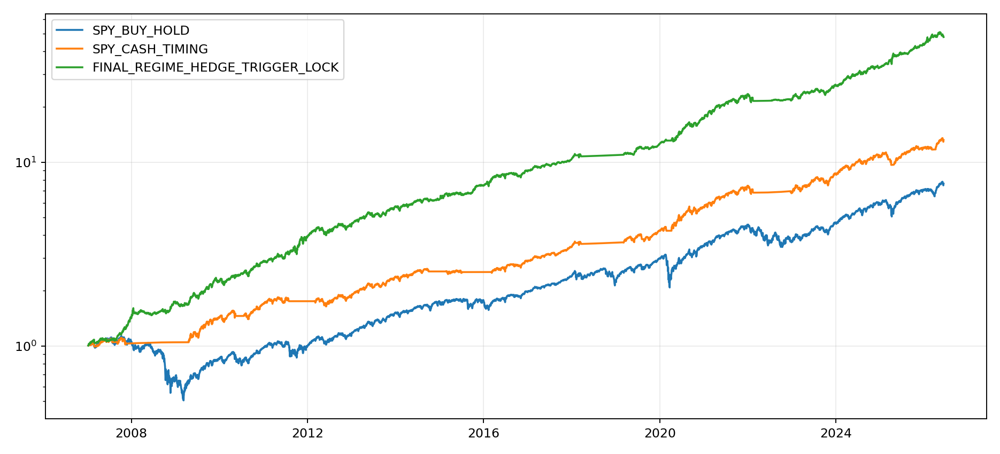

| Strategy | CAGR | Sharpe | Sortino | MaxDD | Calmar | Final Equity |
|---|---:|---:|---:|---:|---:|---:|
| SPY_BUY_HOLD | 11.06% | 0.563 | 0.687 | -55.19% | 0.200 | 7.64 |
| SPY_CASH_TIMING | 14.23% | 1.278 | 1.412 | -14.60% | 0.975 | 13.19 |
| FINAL_REGIME_HEDGE_TRIGGER_LOCK | 22.09% | 1.984 | 2.643 | -9.73% | 2.271 | 47.91 |

## Live Dashboard

[Open the Live Regime Dashboard](https://snow-ouyang.github.io/Regime-Aware-All-Weather-Portfolio/)

The dashboard is the live view of the same mainline logic. It shows:

- current macro regime
- current stress state and active locks
- current oil level
- target allocation
- signal-distance monitors for term spread, oil, VIX, credit, and SPY trend
- regime-to-date performance versus SPY

The publishing source is `docs/index.html`, generated from `results/live_regime_dashboard/live_regime_dashboard.html`.

## Regime Construction

### Outer Term Spread Hysteresis

The first layer is the 10Y-1Y term spread:

`term_spread = DGS10 - DGS1`

This is no longer a single-threshold split. The mainline uses buffered transitions:

- `FLAT -> INVERTED = -0.10`
- `INVERTED -> FLAT = 0.10`
- `FLAT -> STEEP = 1.20`
- `STEEP -> FLAT = 1.00`
- outer regime transitions use `2-day confirm`

We also re-ran single-variable HMM + KDE diagnostics directly on term spread.

#### Full-sample 3-state term spread HMM

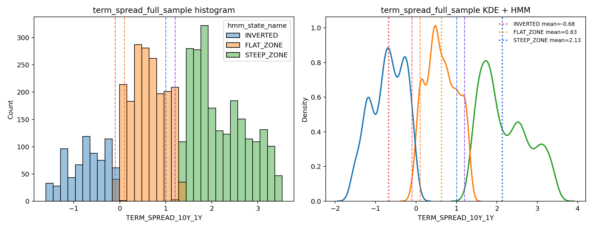

#### Non-inverted 2-state term spread HMM

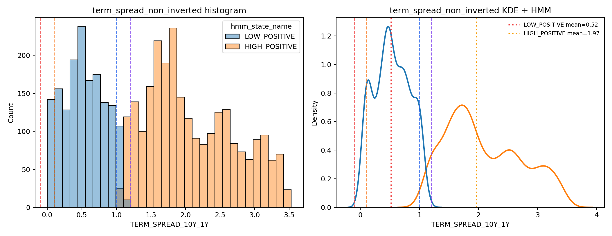

Interpretation:

1. Negative term spread is structurally distinct from positive-rate states.
2. Inside the non-inverted sample, the positive term-spread region still splits into a low-positive zone and a high-positive zone.
3. That is why the final outer rule uses hysteresis instead of a single `0 / 1` cutoff.

### Inner GS10 Structure

Inside `FLAT` and `STEEP`, the mainline uses separate `GS10` low/mid/high state structure, also with hysteresis and `2-day confirm`.

#### FLAT GS10 structure

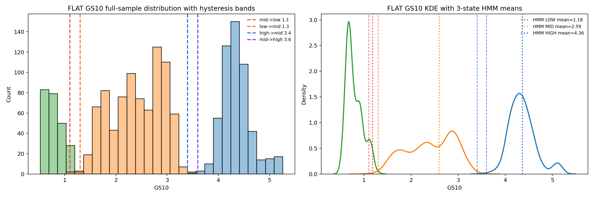

Bands:

- `MID -> LOW = 1.1`
- `LOW -> MID = 1.3`
- `HIGH -> MID = 3.4`
- `MID -> HIGH = 3.6`

#### STEEP GS10 structure

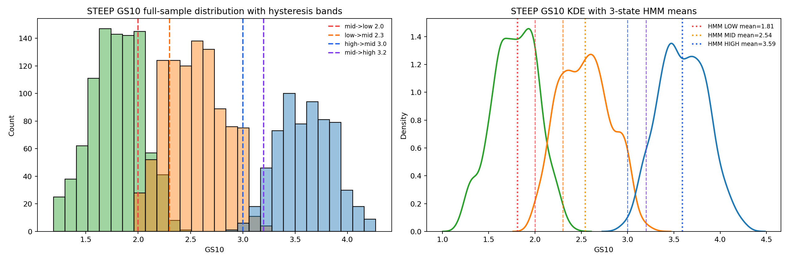

Bands:

- `MID -> LOW = 2.0`
- `LOW -> MID = 2.3`
- `HIGH -> MID = 3.0`
- `MID -> HIGH = 3.2`

The final regime universe is:

- `FLAT_LOW_RATE`
- `FLAT_MID_RATE`
- `FLAT_HIGH_RATE`
- `STEEP_LOW_RATE`
- `STEEP_MID_RATE`
- `STEEP_HIGH_RATE`
- `INVERTED`

## Oil Level Layer

Oil level is now part of the mainline, not a side exploration.

Definition:

- 252-day oil moving average
- `HIGH`: entry at `+20%`, exit at `+5%`
- `LOW`: entry at `-20%`, exit at `-10%`
- state confirmation: `10 trading days`

This creates persistent `OIL_LEVEL_HIGH / MID / LOW` states.

The mainline outputs both:

- `oil level x stress`
- `oil level x non-stress rate regime`

The sequence chart below shows the raw oil price with persistent `HIGH` and `LOW` regime background shading.

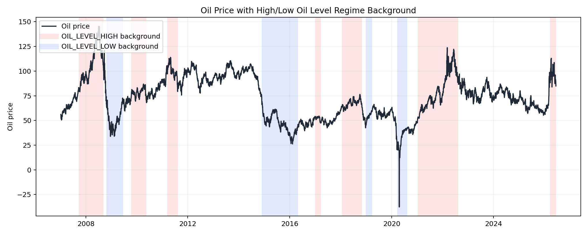

### Oil x Stress

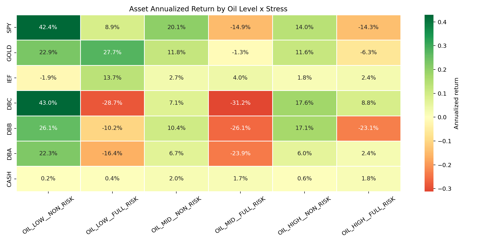

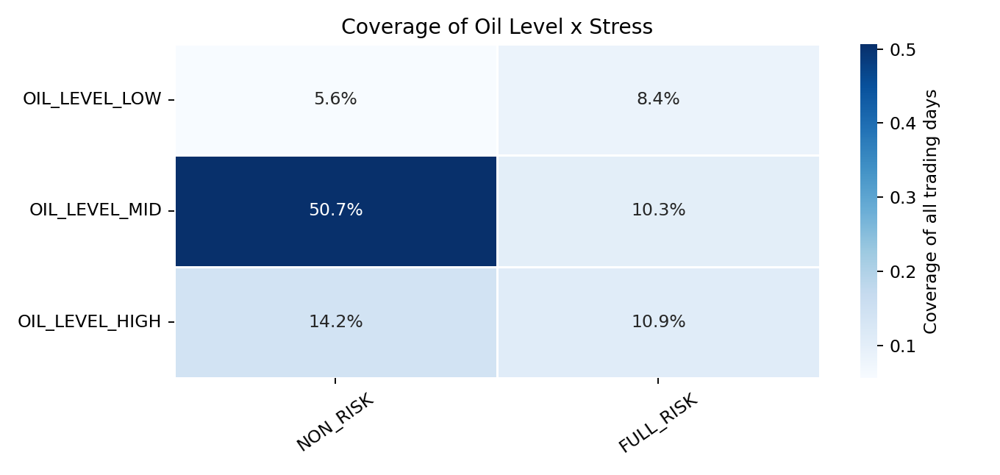

### Oil x Non-Stress Rate Regime

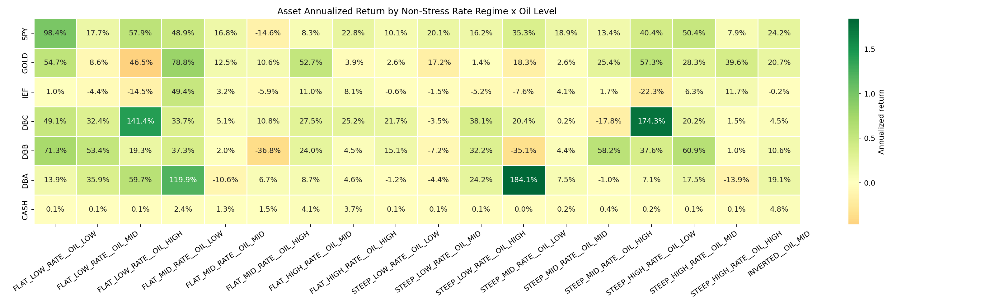

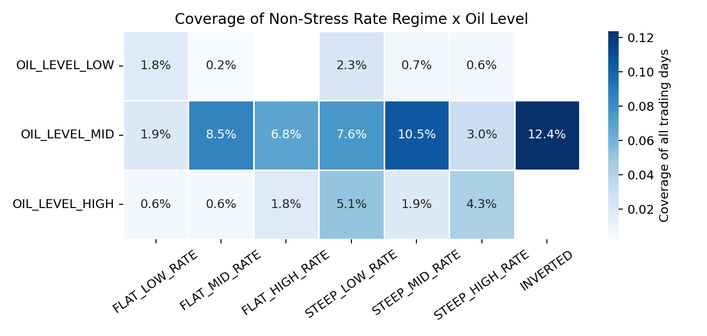

Operationally, when oil is `HIGH`, the flat sleeves remove `GOLD` and `DBB` where applicable.

## Stress Timing

The timing engine remains the original mainline `VIX / CREDIT` trigger-lock framework.

VIX is enabled in:

- `FLAT_LOW_RATE`
- `FLAT_MID_RATE`
- `FLAT_HIGH_RATE`
- `INVERTED`

Credit is enabled in:

- `FLAT_LOW_RATE`
- `FLAT_MID_RATE`
- `FLAT_HIGH_RATE`
- `STEEP_MID_RATE`
- `STEEP_HIGH_RATE`
- `INVERTED`

`STEEP_LOW_RATE` has no native trigger. Any stress there is carry-over from a previous trigger-enabled regime.

Trigger rules:

- VIX entry: `VIX_ZSCORE_120D >= 3.0`
- VIX unlock: `VIX_ZSCORE_120D < 1.5` and `SPY > MA20`
- Credit entry: `D_CREDIT_SPREAD_15D > 0.10` and `SPY <= MA20`
- Credit unlock: `SPY > MA50` and `CREDIT_LEVEL_Z_252D < 0.9`

Anchor behavior:

- if stress started from VIX, VIX unlock is sufficient
- if stress started from credit, credit unlock is sufficient

This same timing engine drives both:

- `SPY_CASH_TIMING`
- `FINAL_REGIME_HEDGE_TRIGGER_LOCK`

## Final Allocation Logic

| Regime / State | Allocation |
|---|---|
| `FLAT_LOW_RATE_NORMAL` | `SPY + DBC + DBB` inverse-vol, but oil `HIGH` removes `DBB` |
| `FLAT_MID_RATE_NORMAL` | `SPY + GOLD` inverse-vol, but oil `HIGH` collapses to `SPY` |
| `FLAT_LOWMID_RATE_STRESS` | `100% CASH` |
| `FLAT_HIGH_RATE_NORMAL` | `40% IEF + 60% (GOLD + DBC inverse-vol)`, but oil `HIGH` removes `GOLD` |
| `FLAT_HIGH_RATE_STRESS` | `10% DBA + 90% GOLD`, but oil `HIGH` collapses to `100% DBA` |
| `STEEP_LOW_RATE_NORMAL` | `100% SPY` |
| `STEEP_LOW_RATE_STRESS` | `100% SPY` |
| `STEEP_MID_RATE_NORMAL` | `100% SPY` |
| `STEEP_MID_RATE_STRESS` | `100% IEF` |
| `STEEP_HIGH_RATE_NORMAL` | `SPY + GOLD` inverse-vol |
| `STEEP_HIGH_RATE_STRESS` | `100% IEF` |
| `INVERTED_NORMAL` | `SPY + GOLD` inverse-vol |
| `INVERTED_STRESS` | `90% CASH + 10% SPY` |

## Heatmap Evidence

The heatmap layer is part of the mainline evidence set.

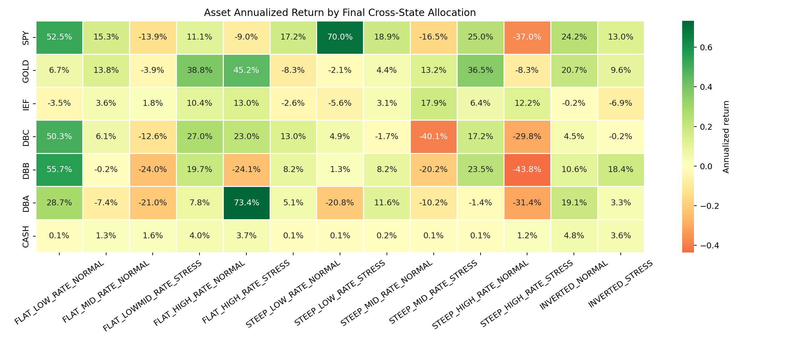

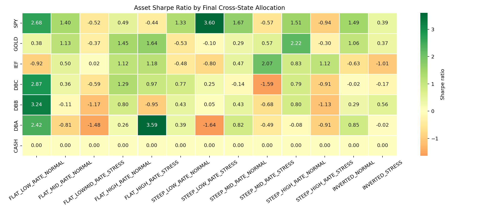

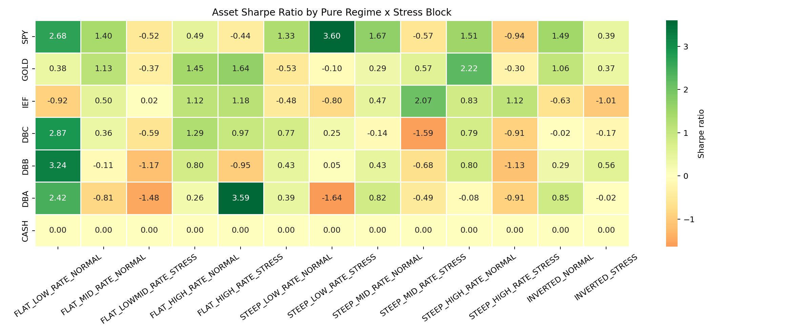

These outputs support the final design:

1. macro variables have internal structure, so buffered regime transitions are justified
2. asset behavior changes materially across refined regimes
3. oil level changes cross-section behavior further inside stress and non-stress buckets

## Crisis Windows

Representative case-study figures are included in the mainline output set:

- 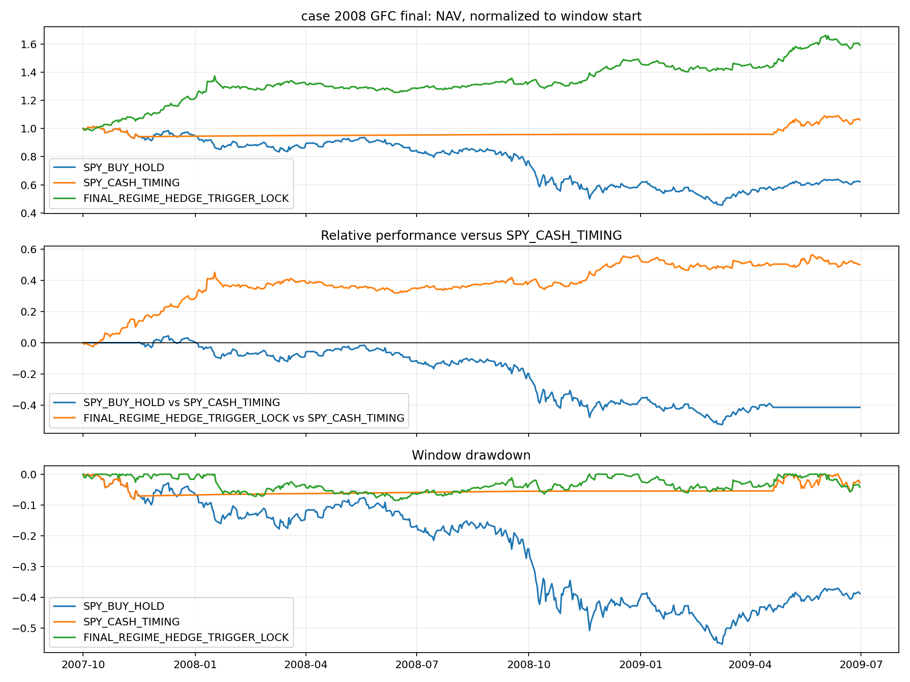
- 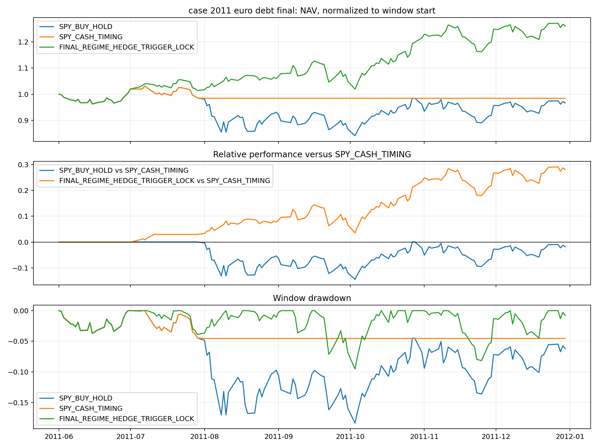
- 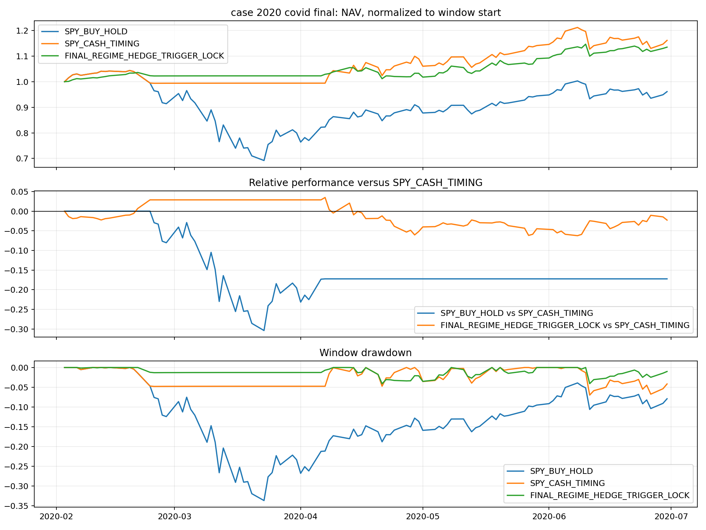
- 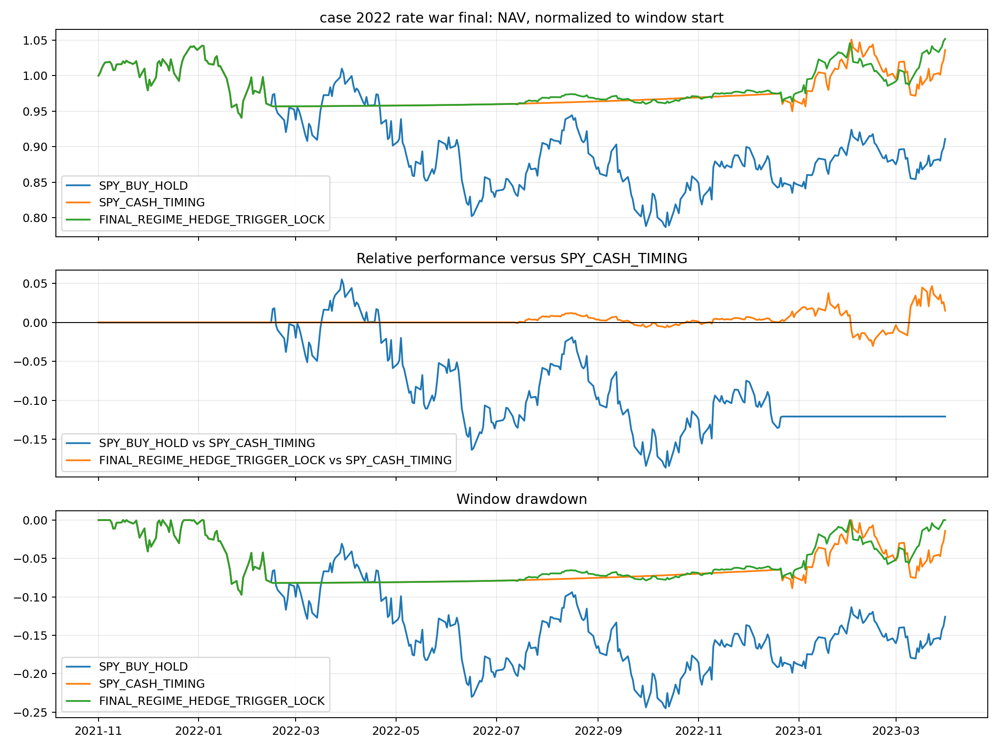

## Canonical Run Order

```bash
python scripts/run_final_strategy_source_only.py
python scripts/08_stress_trigger_diagnostics.py
python scripts/10_final_report_outputs.py
python scripts/30_generate_live_regime_dashboard.py
python scripts/hard_validate_main_pipeline_source_only.py
```

## Main Output Entry Points

- [Mainline strategy README](results/main_pipeline_final/README_final_strategy.md)
- [Mainline performance table](results/main_pipeline_final/tables/strategy_performance_comparison.csv)
- [Live dashboard HTML](results/live_regime_dashboard/live_regime_dashboard.html)
- [Project report](reports/FINAL_REPORT.md)

## Limitations

- This is still research, not out-of-sample proof.
- Some refined cross states remain moderate-sample.
- The HMM/KDE diagnostics justify the regime structure, but they do not by themselves prove allocation optimality.
- Live dashboard freshness depends on external data availability and local cache fallback.
