# Final Report: Regime-Dependent Stress Triggers and Hedge Allocation

**Stress triggers are regime-dependent, and hedge assets are also regime-dependent.**

This project is not a traditional all-weather portfolio and not a generic timing model. It is a **SPY-centered regime-aware index enhancement strategy**. The objective is to keep SPY as the core long-run return engine while reducing major drawdowns through two linked ideas:

1. Stress detection should depend on the macro regime.
2. Hedge allocation should also depend on the macro regime.

The final strategy is:

`FINAL_REGIME_HEDGE_TRIGGER_LOCK`

It is source-only reproducible and does not rely on exploratory intermediate outputs.

## 1. Motivation

Most timing systems try to find a universal risk-off trigger. Most all-weather systems try to hold a static diversified portfolio across macro states. This project takes a different view.

Stress periods are heterogeneous. A VIX panic, a credit widening episode, a commodity-led growth scare, and an inflation/rate shock are not the same event. Likewise, the best hedge asset changes with the macro backdrop. CASH, IEF, GOLD, commodities, and SPY do not have stable roles across all regimes.

The strategy therefore asks:

- Which trigger is valid in which regime?
- Once stress is detected, which hedge asset is actually useful in that regime?
- Can the strategy preserve SPY participation without accepting SPY-like drawdown?

## 2. From ML Discovery to Rule-Based Regimes

The regime framework was inspired by the earlier ML regime project:

[Market-Regime-Clustering](https://github.com/Snow-Ouyang/Market-Regime-Clustering)

The clustering / jump-model research was used as a discovery phase. It helped reveal the natural distribution of macro variables and highlighted that macro states differ across curve shape, inflation pressure, credit conditions, and growth stress.

The final strategy does **not** trade directly on ML states. Instead, the ML evidence was translated into simpler rule-based macro regimes because rule-based regimes are:

- interpretable;
- stable across reruns;
- easier to audit;
- easier to reproduce from source data;
- better suited for a transparent research project.

Local note: the current cleaned repository does not retain the earlier clustering variable-distribution figures. Those can be restored from the upstream ML project if a separate discovery appendix is needed.

## 3. Final Regime Construction

The final macro regime framework is:

- `FLAT_LOW_RATE`
- `FLAT_HIGH_RATE`
- `STEEP`
- `INVERTED`

The first split uses:

`term_spread = GS10 - GS1`

Then raw `FLAT` is split by absolute rate level using `GS10 = 2.9`.

| Regime | Rule | Threshold Source | Economic Interpretation | Strategy Implication |
|---|---|---|---|---|
| `INVERTED` | `term_spread < 0` | Yield-curve inversion | Tight policy, late-cycle inversion, unreliable stress-trigger quality | No full-risk trigger; SPY / GOLD inverse-vol |
| Raw `FLAT` | `0 <= term_spread <= 1` | Flat curve band | Curve shape is flat but rate level matters | Split by GS10 |
| `FLAT_LOW_RATE` | raw `FLAT` and `GS10 <= 2.9` | Near FLAT-sample GS10 median | Low-rate flat state; SPY and commodities can still work | Normal pool uses SPY / CMDTY_FUT |
| `FLAT_HIGH_RATE` | raw `FLAT` and `GS10 > 2.9` | Same median-based split | High-rate flat state; equity exposure is less attractive | Normal pool uses GOLD / CMDTY_FUT |
| `STEEP` | `term_spread > 1` | Positive curve slope | Recovery, reflation, or policy-easing expectation; can hide commodity-led slow-growth stress | Non-risk 100% SPY; stress hedge GOLD / IEF |

The 2.9 GS10 threshold is not presented as an optimized parameter. It is a structural split near the FLAT-sample median. It is used because asset behavior differs materially between low-rate and high-rate flat regimes.

### Extreme Inflation

The ML discovery work showed oil-shock / policy-driven inflation-like states. In the current source-only tradable sample, there was not enough stable evidence to define a separate final `EXTREME_INFLATION` regime. The strategy therefore avoids forcing a regime that the sample cannot support. That said, this finding is one reason real assets, commodities, and gold are central to the final allocation research.

## 4. Why This Is Not an All-Weather Portfolio

Traditional all-weather portfolios are generally designed as static or semi-static diversification across growth and inflation quadrants.

This project is different:

- SPY remains the primary return engine.
- Macro regime determines which stress triggers are active.
- Stress episodes are managed with trigger locks rather than one-day exits.
- Hedge sleeves are regime-specific rather than universal.

This is a SPY-centered regime-aware index enhancement strategy. The goal is not to minimize volatility at all costs, but to preserve equity participation while reducing major regime-specific drawdowns.

Monthly trend timing was explored early as a benchmark, but it is not part of the final thesis. The final strategy replaces monthly timing with a higher-frequency trigger-lock stress system.

## 5. Regime-Specific Trigger-Lock Stress System

The final stress module is a trigger-lock state machine.

Each trigger has:

- an enabled regime set;
- an entry condition;
- an unlock condition;
- an economic interpretation.

When a trigger fires, it creates an active lock. The strategy stays in full-risk mode until all active locks are unlocked. Locks can be added during an existing stress episode, and each lock can be released independently.

| Trigger | Enabled Regimes | Entry | Unlock | Economic Meaning | Main Purpose |
|---|---|---|---|---|---|
| VIX lock | `STEEP`, `FLAT_LOW_RATE`, `FLAT_HIGH_RATE` | `VIX_ZSCORE_120D >= 3.0` | `VIX_ZSCORE_120D < 1.5` | Fast panic / volatility shock | Catch sudden volatility stress |
| Credit lock | `FLAT_LOW_RATE`, `FLAT_HIGH_RATE` | SPY drawdown <= -5% and `D_CREDIT_SPREAD_15D > 0.10` | `D_CREDIT_SPREAD_15D < 0` and SPY > MA20 | Price-confirmed credit stress | Avoid credit-led drawdowns |
| Commodity lock | `STEEP` | `CMDTY_RET60 < -10%` | `CMDTY_RET60 > -5%` and SPY > MA20 | STEEP slow-growth / commodity-led stress | Repair 2015-2016 style stress |

Important design choices:

- Monthly SELL is not used in the final strategy.
- Credit trigger is not enabled in `INVERTED`.
- Commodity trigger is only used in `STEEP`.
- If VIX and credit locks are both active, VIX unlock also unlocks credit.

## 6. Trigger-to-Unlock Episode Diagnostics

Forward 20-day return is useful, but it is incomplete for a lock-based strategy. The final strategy should be evaluated from trigger entry to unlock exit.

| Regime | Trigger | Episodes | Avg Lock Duration | Mean Strategy Return During Stress | Mean SPY Return During Stress | Mean SPY MaxDD During Stress | Mean Drawdown Reduction vs SPY |
|---|---:|---:|---:|---:|---:|---:|---:|
| `FLAT_HIGH_RATE` | CREDIT | 2 | 66.0d | 3.99% | -3.25% | -15.50% | 11.97% |
| `FLAT_HIGH_RATE` | VIX | 7 | 12.6d | -0.02% | 1.24% | -3.55% | 2.54% |
| `FLAT_LOW_RATE` | CREDIT | 5 | 26.4d | 3.05% | 2.44% | -5.58% | 2.31% |
| `FLAT_LOW_RATE` | VIX | 4 | 16.0d | 0.94% | -2.92% | -10.32% | 6.18% |
| `STEEP` | CMDTY | 8 | 66.8d | 4.68% | -3.15% | -13.52% | 10.23% |
| `STEEP` | VIX | 9 | 8.8d | -0.61% | 2.08% | -2.13% | 1.00% |

Interpretation:

- VIX lock mainly catches fast crash conditions; not every VIX spike is a profitable hedge episode.
- Credit lock is strongest in `FLAT_HIGH_RATE`, where price-confirmed credit stress tends to be more damaging.
- Commodity lock is the key fix for `STEEP` slow-growth stress, particularly the 2015-2016 commodity / growth scare.
- The same trigger can be effective in one regime and noisy in another.

Core files:

- `results/main_pipeline_final/tables/stress_entry_attribution.csv`
- `results/main_pipeline_final/tables/trigger_effectiveness_summary.csv`
- `results/main_pipeline_final/figures/stress_entry_timeline_by_trigger.png`
- `results/main_pipeline_final/figures/trigger_regime_spy_timeline_long.png`

## 7. Regime x Stress Asset Behavior

The most important empirical evidence is cross-state asset behavior.

The final allocation is not assigned arbitrarily. It is derived from observed asset behavior under each regime-stress cross state.

Summary:

- `FLAT_LOW_RATE_NORMAL`: SPY and commodities are strong. GOLD is removed from the normal pool.
- `FLAT_LOW_RATE_STRESS`: GOLD has the strongest defensive profile.
- `FLAT_HIGH_RATE_NORMAL`: GOLD and commodities dominate SPY. IEF is not included in the final normal pool.
- `FLAT_HIGH_RATE_STRESS`: IEF performs best, with CASH used as a stabilizer.
- `STEEP_NON_RISK`: SPY is the return engine.
- `STEEP_FULL_RISK`: 30% GOLD / 70% IEF is used instead of a single hedge asset.
- `INVERTED`: the final strategy keeps SPY / GOLD inverse-vol and does not force a full-risk state.

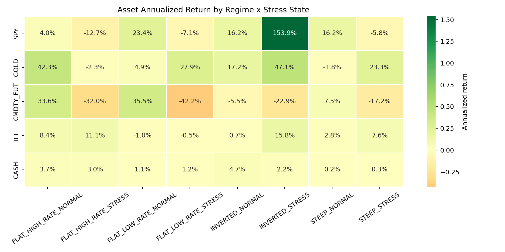

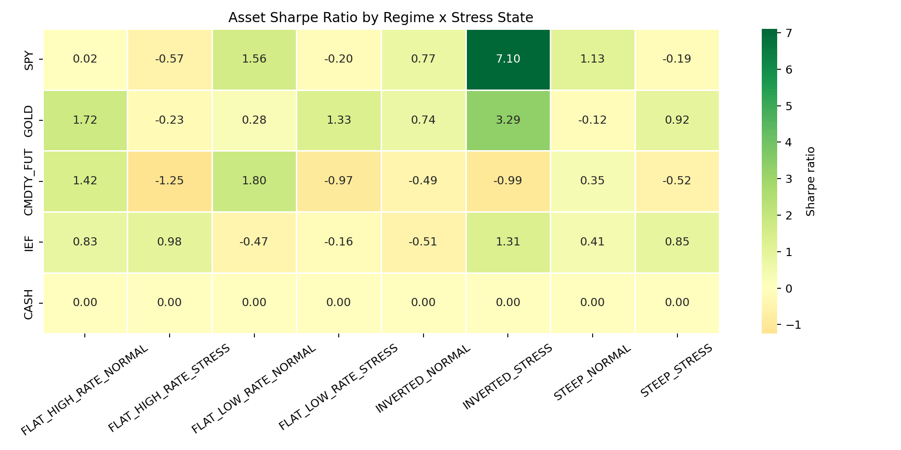

## 8. Final Strategy Allocation

| Macro Regime | State | Trigger Condition | Allocation | Rationale |
|---|---|---|---|---|
| `FLAT_LOW_RATE` | Normal | No active VIX or credit lock | SPY / CMDTY_FUT inverse-vol | Low-rate flat state can still reward equity and commodity exposure |
| `FLAT_LOW_RATE` | Stress | VIX or credit lock active | 100% GOLD | Gold is the strongest defensive asset in this cross-state |
| `FLAT_HIGH_RATE` | Normal | No active VIX or credit lock | GOLD / CMDTY_FUT inverse-vol | High-rate flat state favors real assets over SPY |
| `FLAT_HIGH_RATE` | Stress | VIX or credit lock active | 90% IEF / 10% CASH | IEF has the best stress evidence; CASH stabilizes the hedge sleeve |
| `STEEP` | Normal | No active VIX or commodity lock | 100% SPY | STEEP is typically equity-friendly |
| `STEEP` | Full risk | VIX or commodity lock active | 30% GOLD / 70% IEF | IEF handles duration stress; GOLD diversifies commodity / inflation shock risk |
| `INVERTED` | Normal only | No full-risk trigger enabled | SPY / GOLD inverse-vol | Inversion is not treated as automatic cash risk-off |

## 9. Backtest Results

| Strategy | CAGR | Sharpe | Sortino | MaxDD | Calmar | Final Equity |
|---|---:|---:|---:|---:|---:|---:|
| SPY_BUY_HOLD | 11.14% | 0.575 | 0.702 | -55.19% | 0.202 | 8.38 |
| SPY_CASH_TIMING | 12.04% | 0.948 | 1.101 | -29.45% | 0.409 | 9.86 |
| FINAL_REGIME_HEDGE_TRIGGER_LOCK | 19.63% | 1.460 | 1.959 | -18.28% | 1.074 | 36.91 |

Compared with SPY buy-and-hold:

- CAGR improves from 11.14% to 19.63%.
- Sharpe improves from 0.575 to 1.460.
- MaxDD falls from -55.19% to -18.28%.
- Final equity improves from 8.38 to 36.91.

The improvement is not from a single optimized trigger. It comes from the interaction of regime-specific triggers, trigger-lock stress episodes, regime-specific hedge allocation, and inverse-vol normal allocation.

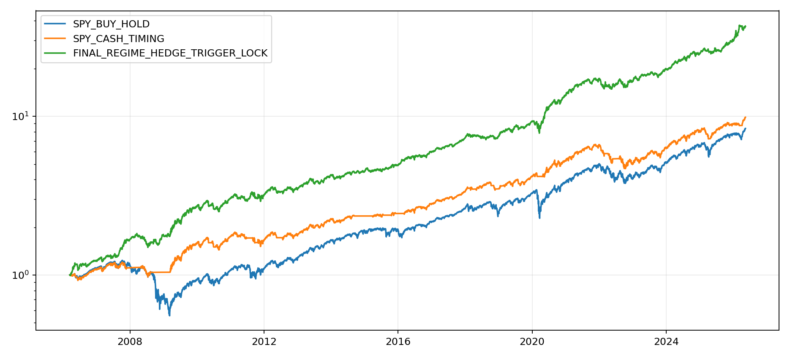

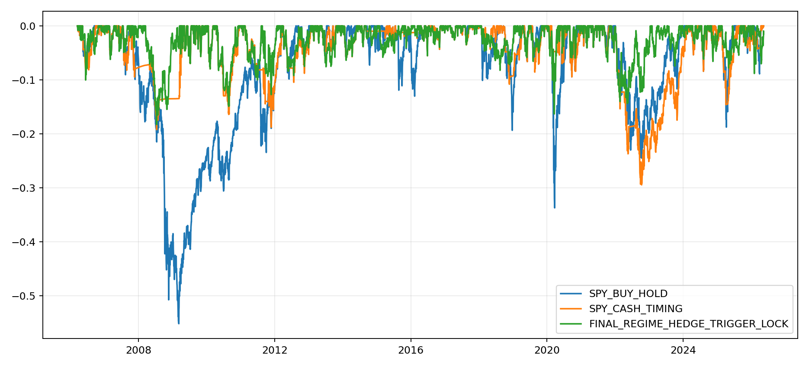

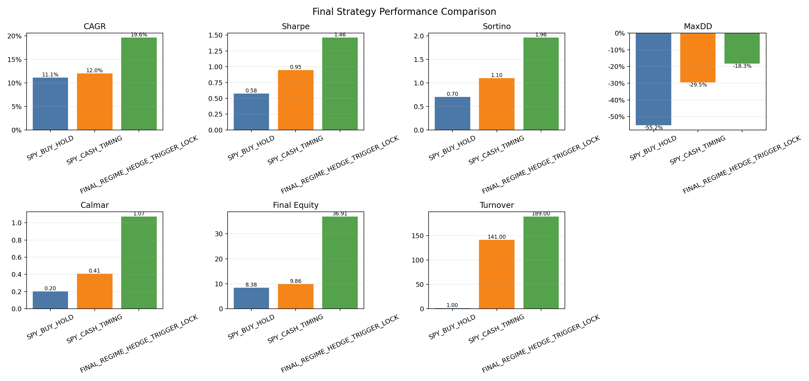

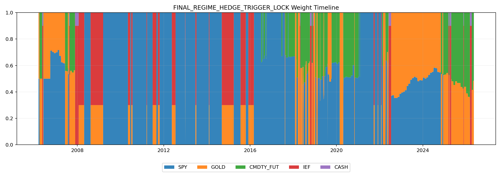

## 10. Crisis Window Analysis

| Window | Main Stress Type | Trigger / State | Hedge Behavior | Result |
|---|---|---|---|---|
| 2008 GFC | Credit and broad risk stress | FLAT_HIGH credit, later STEEP commodity lock | IEF / GOLD hedge exposure avoided the largest equity damage | Final +47.75%, SPY -37.16% |
| 2015-2016 | Commodity / growth stress | STEEP commodity lock | GOLD / IEF hedge repaired the original missed slow-growth stress | Final +19.72%, MaxDD -4.01% |
| COVID 2020 | Fast volatility shock | FLAT_LOW VIX / credit locks | GOLD helped, though fast SPY recovery created opportunity cost | Final +27.41%, MaxDD -15.50% |
| 2022 rate / inflation / war shock | Rate shock and inflation stress | STEEP / FLAT locks | Regime-specific hedge sleeves beat SPY and SPY/CASH timing | Final +6.07%, MaxDD -14.39% |
| 2025 pullback | High-rate volatility stress | FLAT_HIGH VIX lock | IEF / CASH stress sleeve reduced drawdown | Final +19.99%, MaxDD -7.79% |

Case studies:

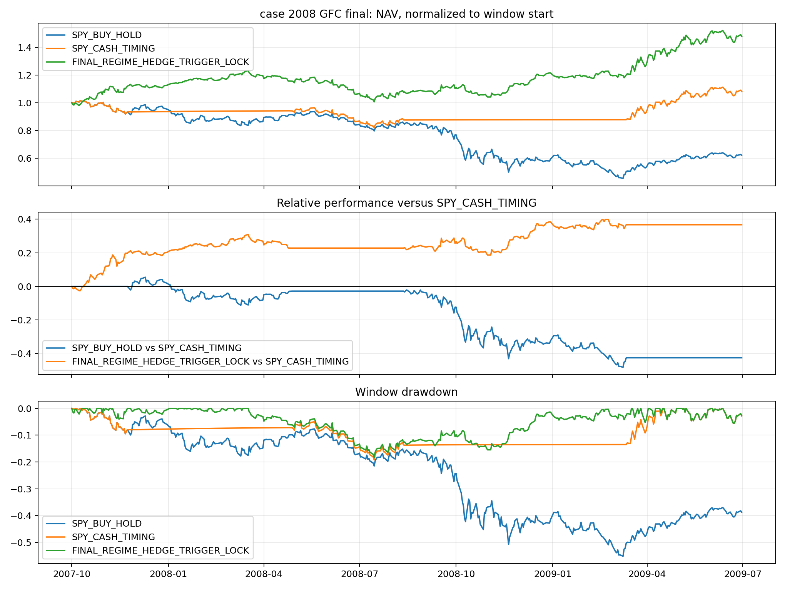

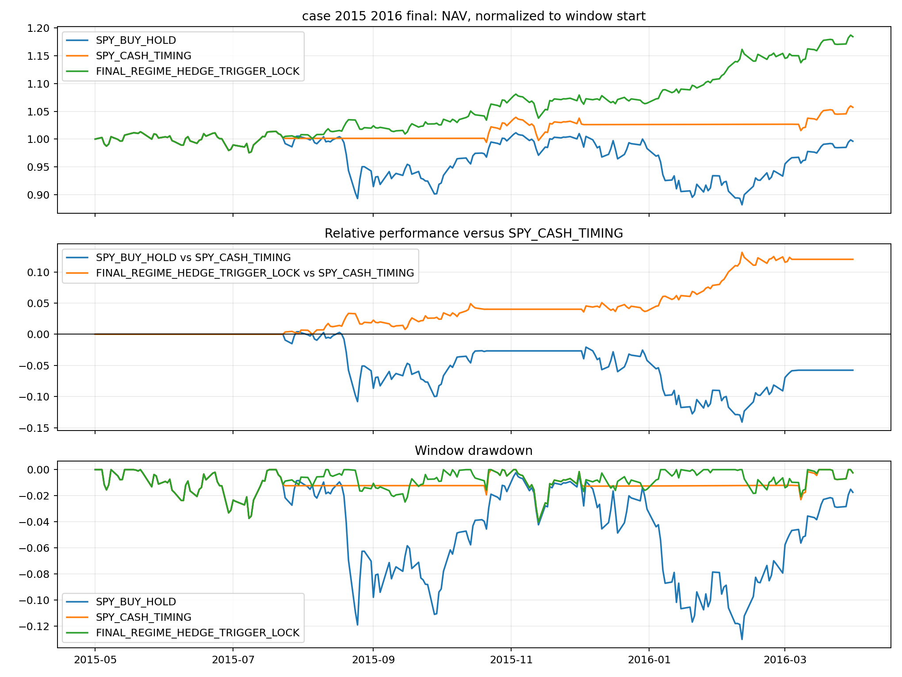

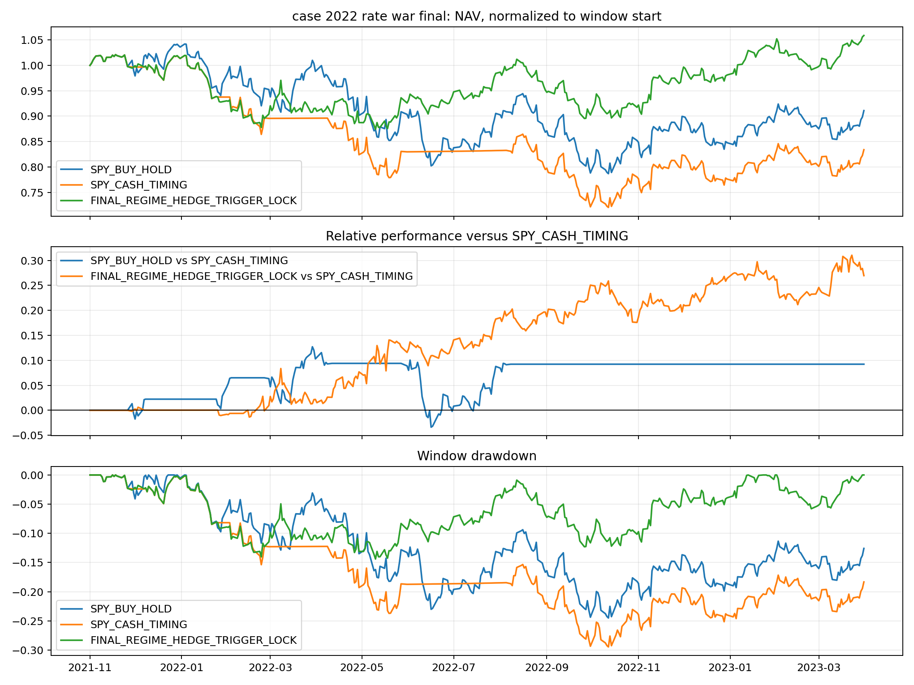

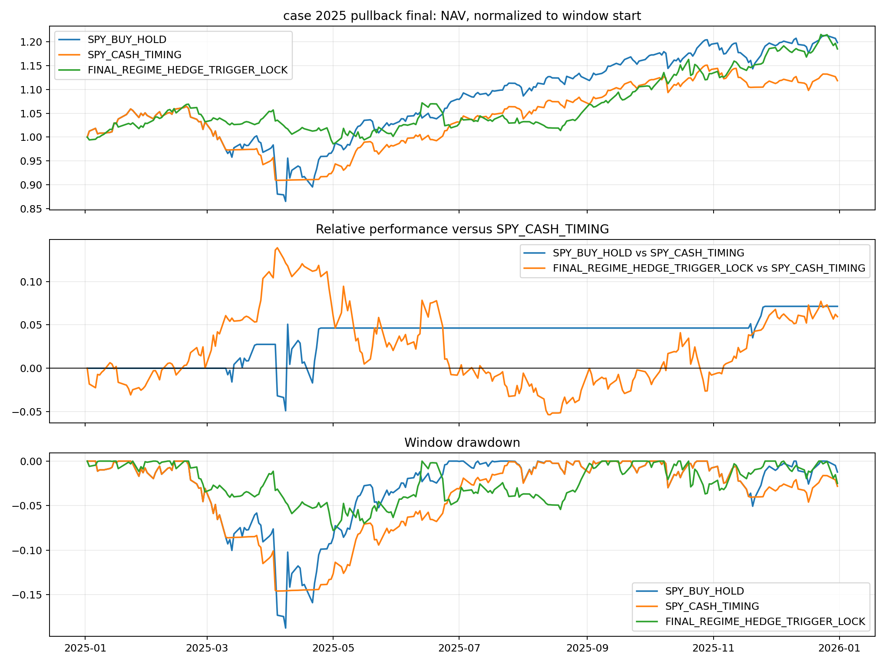

## 11. Trigger and Turnover Diagnostics

The final stress system is not optimized to minimize turnover. Turnover is mainly caused by full-risk entry and unlock events, not by inverse-vol rebalance.

Diagnostic summary:

- Total full-risk entries: 35.
- Total full-risk exits: 35.
- Top turnover events are full-risk unlock exits and VIX entries.
- `STEEP -> STEEP` turnover is mostly internal transition between `STEEP_NON_RISK` and `STEEP_FULL_RISK`.
- Recovery overlay is not part of the final mainline.

Relevant figures:

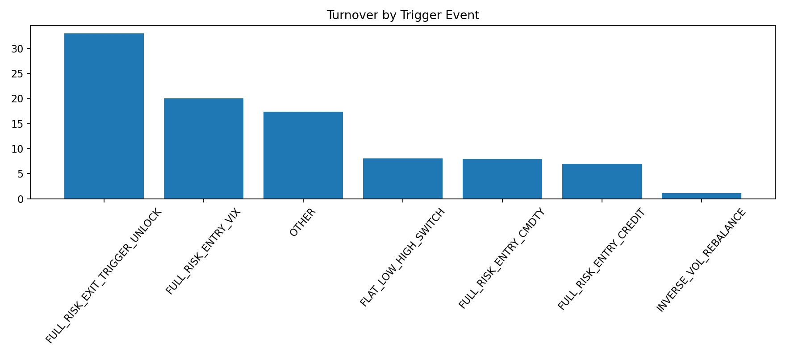

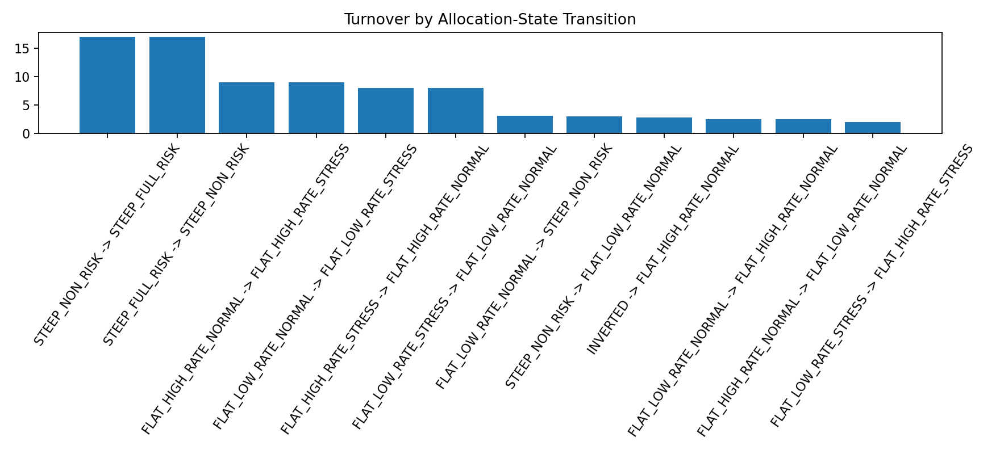

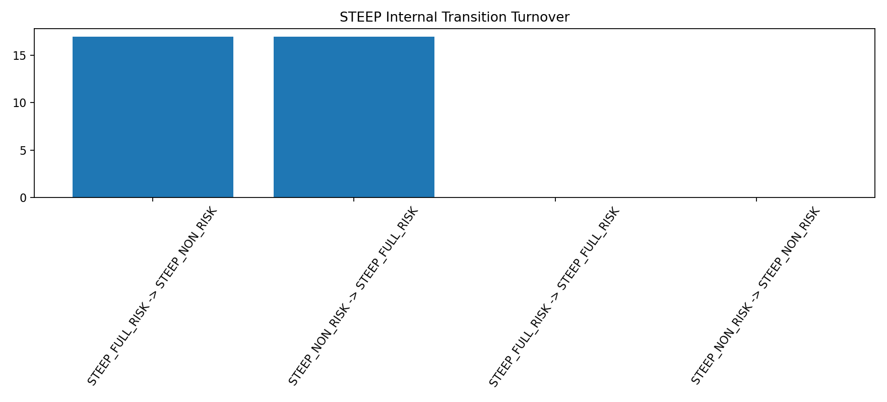

## 12. Methodology Notes

- The mainline is source-only and uses `data/raw` and `data/processed`.
- It does not depend on old validated or exploratory result folders.
- Signal day `t` affects position on day `t+1`.
- Regime confirmation requires 3 consecutive days.
- There is no `NEUTRAL` regime and no fallback allocation.
- Inverse-volatility uses a 120 trading day window.
- Transaction cost is 10 bps one-way.
- CASH uses compounded daily DTB3.
- Credit spread uses WBAA - WAAA.
- Final credit-lock logic uses `D_CREDIT_SPREAD_15D`.
- VIX z-score uses a 120 trading day rolling window, current-day inclusive, `ddof=1`.
- No look-ahead data is used for strategy generation.

Run order:

```bash
python scripts/01_data_prepare.py
python scripts/02_rule_based_regime.py
python scripts/03_stress_detection.py
python scripts/04_asset_return_panel.py
python scripts/05_baseline_strategy.py
python scripts/06_flat_rate_refined_strategy.py
python scripts/07_cross_state_asset_behavior.py
python scripts/08_stress_trigger_diagnostics.py
python scripts/09_final_strategy_recovery_flat_low_only.py
python scripts/10_final_report_outputs.py
```

The name `09_final_strategy_recovery_flat_low_only.py` is historical. It now outputs the trigger-lock final strategy.

## 13. Limitations

- Stress events are sparse and heterogeneous.
- Commodity proxy choice affects commodity-trigger timing.
- Macro data may be revised or published with delay.
- Trigger-lock thresholds require out-of-sample validation.
- The strategy remains SPY-centered, not minimum-volatility.
- Regime thresholds are economically motivated but still simplified.
- The strategy is research code and not financial advice.

## 14. Final Interpretation

The main contribution is not a single optimized trigger. The main contribution is a regime-conditioned framework showing that both stress detection and hedge allocation depend on the macro regime.

The final strategy shows that:

- VIX, credit, and commodity stress do not have the same meaning in every regime.
- GOLD, IEF, CASH, commodities, and SPY do not have fixed roles across regimes.
- A regime-aware trigger-lock state machine can preserve equity participation while materially reducing major drawdowns.
